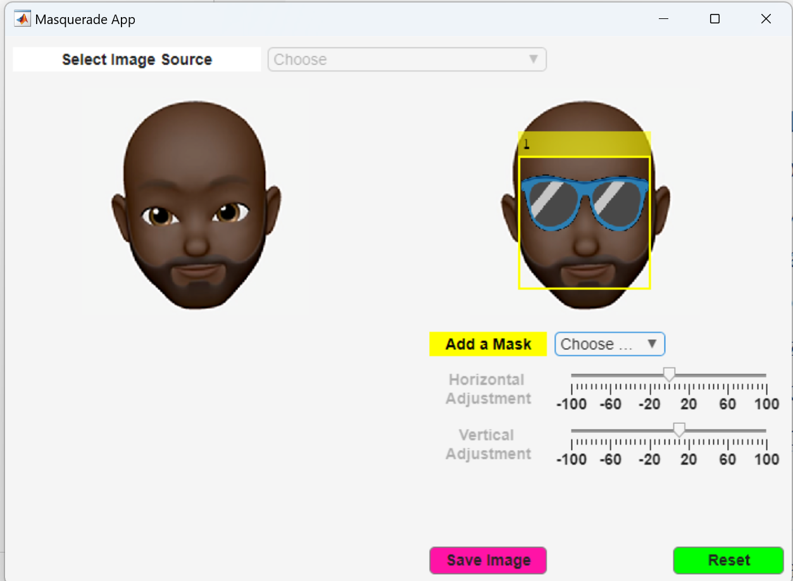

# Masquerade App

 or 

**Curriculum Module**

_Created with R2024a. Compatible with R2024a and later releases._

# Information

This curriculum module contains an interactive [MATLAB® App](https://www.mathworks.com/help/matlab/creating_guis/apps-overview.html) that allows users to add various effects to images.

## Background

You can use this app as a demonstrations in lectures, K\-12 outreach activities. This module covers image processing and object detection.

 Get started with the  [MATLAB® App](https://www.mathworks.com/help/matlab/creating_guis/apps-overview.html)  that allows users to add various effects to images.
 App by installing it into your Apps. 

## Contact Us

Solutions are available upon instructor request. Contact the [STEM Outreach Team](http://stemoutreach@groups.mathworks.com) if you would like to provide feedback, or if you have a question.

## Prerequisites

This module assumes no prerequisite knowledge.

## Getting Started
### Accessing the Module
### **On MATLAB Online:**

Use the  link to download the App. You will be prompted to log in or create a MathWorks account. The App will be loaded and you can get you started.

### **On Desktop:**

Download or clone this App. Open MATLAB, navigate to the folder containing these scripts and double\-click on App. You will be prompted to install the App into your Apps. 

Ensure you have all the required products (listed below) installed. If you need to include a product, add it using the Add\-On Explorer. To install an add\-on, go to the **Home** tab and select   **Add-Ons** > **Get Add-Ons**. 

## Products

MATLAB® is used throughout. Tools from the [MATLAB® Support Package for USB Webcams](https://www.mathworks.com/matlabcentral/fileexchange/45182-matlab-support-package-for-usb-webcams?s_tid=srchtitle_support_results_1_webcam%20support%20package) are used frequently as well. The [vision.CascadeObjectDetector](https://www.mathworks.com/help/vision/ref/vision.cascadeobjectdetector-system-object.html) function from the  [Computer Vision Toolbox](https://www.mathworks.com/help/vision/index.html?s_tid=hc_product_card) is used*.*

## | 
    | **In this app, users will...**    -  Load images or take selfies    -  Apply various image effects to manipulate the images    -  Save images with effects    | **Academic disciplines**    -  Image Processing    -  Object Detection     |
| :-- | :-- | :-- |

# License

The license for this module is available in the [LICENSE.md](https://github.com/MathWorks-Teaching-Resources/masquerade-App/blob/release/LICENSE.md).

# Educator Resources
-  [Educator Page](https://www.mathworks.com/academia/educators.html) 

# Contribute 

Looking for more? Find an issue? Have a suggestion? Please contact the [STEM Outreach Team](http://stemoutreach@groups.mathworks.com). 

 *©* Copyright 2024 The MathWorks, Inc

